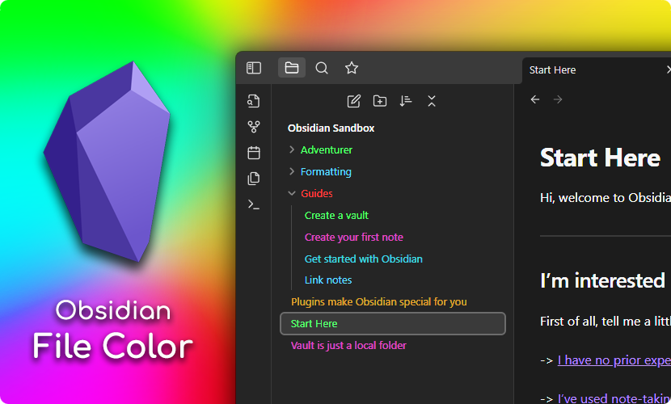
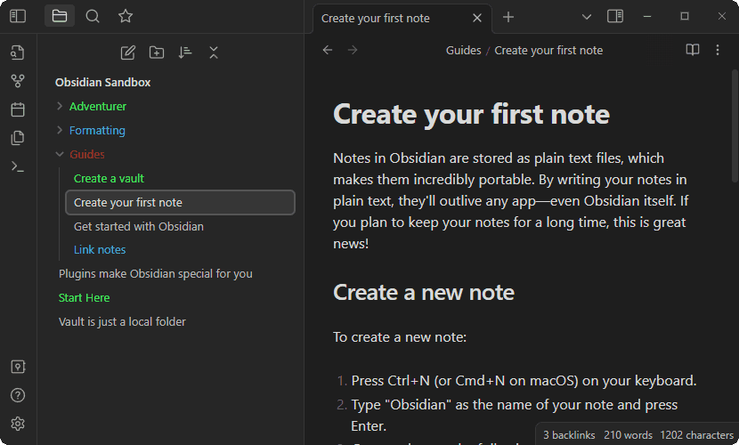
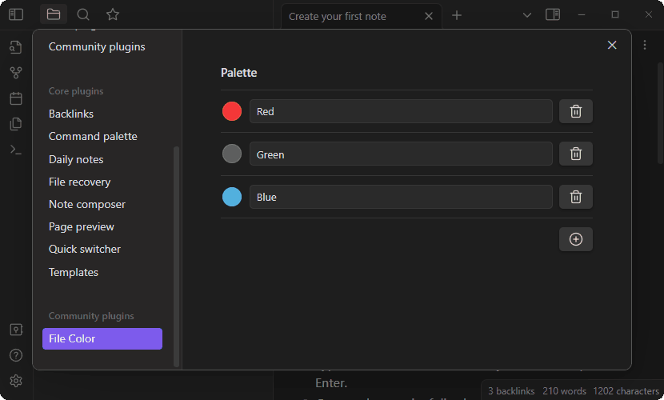

# Obsidian File Color



## What is this?
This is a plugin for [Obsidian](https://obsidian.md), which allows you to select colors for your files and folders in the file explorer.

## Usage

Setting the color for a file or folder is done by right clicking on the file in the file explorer and selecting `Set color`. This opens a modal where you can select all the colors defined in the plugin palette.



### Changing the palette

To add colors to the palette open the plugin settings, and click the `+` button. Then use the color picker to select the color, and input a name for the color. Afterwards it will appear in the `Set color` modal. You can add as many colors as you need.



### Options

- Color Inheritance: if turned on, sub-folders and notes inherit colors from parents. Set colors on children folders/notes to override parents.
- Color Background: if turned on, the background is colored instead of the text.

## Compatibility

This plugin has been tested with a few other community plugins:

* [Icon Folder](https://github.com/FlorianWoelki/obsidian-icon-folder)
  * Should work out of the box, and colors should automatically be applied to the icons as well.
* [Folder Note](https://github.com/aidenlx/folder-note-core)
  * Will also work out of the box, however the underlines added to the files will not be colored.
  * Personally I use the following CSS snippet locally:

    ```css
    .nav-folder.alx-folder-with-note>.nav-folder-title>.nav-folder-title-content {
      text-decoration-style: dotted;
      text-decoration-color: inherit;
    }
    ```
    Which will make make the underline use the colors defined by this plugin. The result looks something like this:

    
---

<div align="center">
  <a href="https://www.buymeacoffee.com/ecustic">
    
  </a>
</div>